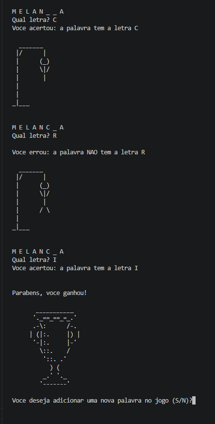

# Hangman Game (C)

A terminal-based Hangman game developed in C as part of my C programming studies.

## Features

- Random word selection
- File handling
- ASCII-based interface
- Add new words
- Input validation
- Modular code organization
- Header files

## Concepts

- Pointers
- Strings
- Arrays
- Functions
- Structs
- File handling
- Header files
- Modular programming
- Random number generation

## Technologies

- C
- GCC
- Standard C Library

## Project Structure

```text
src/
├── forca.c
└── forca.h

data/
└── palavras.txt

images/
└── preview.png
```

## How to Run

### Linux

```bash
gcc src/forca.c -o hangman
./hangman
```

### Windows (MinGW)

```bash
gcc src/forca.c -o hangman.exe
hangman.exe
```

> Run the program from the project root directory so the word list can be loaded correctly.

## Preview



## Author

Eduardo Müller Heck